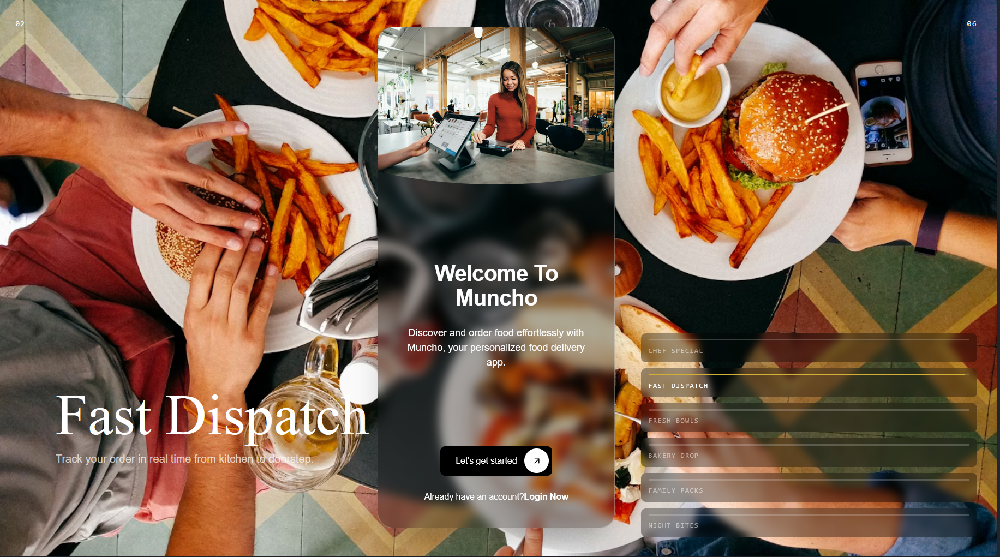

# Muncho App

Muncho is a food delivery and restaurant discovery platform with a React frontend and an Express backend.

## Preview



## Project Structure

- `frontend/` - React + Vite + Tailwind CSS app
- `backend/` - Node.js + Express + MongoDB API

## Tech Stack

### Frontend
- React 19
- Vite 8
- Tailwind CSS 4
- React Router
- Framer Motion
- GSAP + Three.js (animated backgrounds)

### Backend
- Node.js + Express 5
- MongoDB + Mongoose
- JWT auth
- Cookie-based auth handling

## Prerequisites

- Node.js 20+
- npm 10+
- MongoDB connection string

## Environment Variables

Create `backend/.env` with at least:

```env
PORT=5000
MONGO_URI=your_mongodb_connection_string
JWT_SECRET=your_jwt_secret
```

## Installation

From the repo root:

```bash
npm install
cd backend && npm install
cd ../frontend && npm install
```

## Run the App

### 1. Start backend

```bash
cd backend
npm run dev
```

### 2. Start frontend

```bash
cd frontend
npm run dev
```

Frontend runs on `http://localhost:5173` by default.

## Build Frontend

```bash
cd frontend
npm run build
```

## Current Routes (Frontend)

- `/` - Landing / onboarding demo
- `/signin` - Sign in page
- `/signup` - Sign up page
- `/restaurants` - Restaurant list page

## Notes

- Tailwind CSS and shadcn-style component structure are in use (`frontend/src/components/ui`).
- TypeScript components are supported in the frontend, though the project is not yet fully migrated to a strict TS setup.

